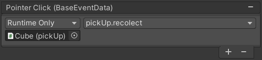
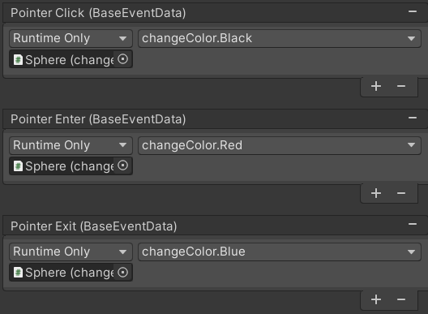

# Escenas Cardboard

Esther Jorge Paramio

#### Crear una aplicación Unity con cubos y esferas y la convertirla en una aplicación VR. 

Para el uso de Cardboards, creamos un proyecto de Unity en 3D y lo convertimos en un aplicación VR. Para ello, realizamos los siguientes pasos:

- Descargamos el paquete *GoogleVRForUnity_1.200.1.unitypackage* y lo importamos a nuestro proyecto. 
- Vamos a ```Build Settings```, pulsemos en *Android* y seleccionamos ```Switch Platform``` para poder desarrollar nuestro proyecto en dispositivos *Android*.
- Ahora, vamos a ```Player Settings``` que se encuentra en la misma pestaña que hemos abierto en el paso anterior y en ```Player``` y seleccionamos ```XR Settings > Virtual Reality Supported``` para que nuestra aplicación soporte aplicaciones de realidad virtual.
- En la misma pestaña del paso anterior, en ```Virtual Reality SDks``` y en la *+* añadimos ```Cardboard```.
- A continuación, en la misma ventana, nos vamos a ```Other Settings > Vulkan``` y le damos al *-* para eliminarlo. Además, añadimos con el *+* ```OpenGLES2``` y eliminamos ```OpenGLES3``` porque la primera soporta versiones antiguas.
- Cerramos todas las ventanas anteriores y nos dirigimos a *SampleScenes*. Creamos un objeto vacío y le ponemos como hijo la cámara principal, una vez hecho esto, en el reseteamos el *transform* de *MainCamera* desde el inspector de objetos.
- Luego, en la raíz añadimos buscando en *Project* el *gameObject* *GvrEditorEmulator* y si ejecutamos el programa podemos mover la cámara en los ejes *X* y *Z* con *alt + ratón* y en el eje *Y* con *ctrl + ratón*. Esto hará que desde el móvil se pueda mover según el movimiento de nuestra cabeza.
- A continuación, le añadimos como hija de la *MainCamera* el *gameObject* *GvrReticlePointer*. Esto añadirá un punto en la pantalla que representará la retícula del ojo a la cual se le podrá cambiar de color. 
- Por último, para realizar eventos varios en función a la retícula del ojo, en la raíz añadimos también el *gameObject* *GvrEventSystem*.

Realizando los pasos anteriores en orden, tendremos nuestro proyecto listo para crear una aplicación para Android de realidad virtual.

#### El jugador podrá recolectar cubos y cambiar de color las esferas. Inicialmente las esferas serán blancas y el nuevo color debe eligirlo entre 3 opciones en la UI.

Para este punto, inicialmente colocaremos un plano a forma de suelo y sobre él vamos añadirle varios cubos. Creamos, y asignamos a los cubos, un *script* llamado *pickUp.cs* y vamos a declarar un método que incremente un contador de cubos y destruimos el objeto recolectado. 

```SQL
public void recolect() {
  countCubes++;
  Destroy(gameObject);
}
```

Desde la interfaz, añadimos al cubo el evento *pointerClick* para que cuando la retícula esté sobre el cubo y se haga *click*, este realice la función asignada del *script*, en este caso *recolect*.



Para realizar el otro punto, colocamos varias esferas en la escena y les asignamos un *script* al que llamamos *changeColor.cs*. En este, vamos a obtener la componente *Renderer* de cada objeto y declarar tres funciones que cambien la propiedad ```rd.material.color``` para asignar, según la función, el color querido.

```SQL
public void Red() {
  rd.material.color = Color.red;
}

public void Blue() {
  rd.material.color = Color.blue;
}   

public void Black() {
  rd.material.color = Color.black;
}
```

Por último, al igual que con el cubo, a cada función le asignamos un evento diferente con la retícula. En este caso, si la retícula entra, la esfera se cambia a color rojo; si esta sale, se cambia a color azul y si clicas se cambia a color negro.



### APK

Para crear el *apk*, hacemos ```Build Settings > Build``` y nos la instalamos en el móvil. El resultado se vería tal que así.

[](imgs/escenaFinal.mp4)


